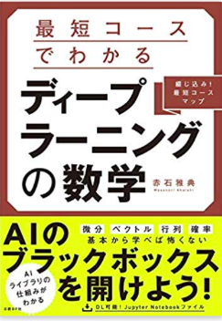
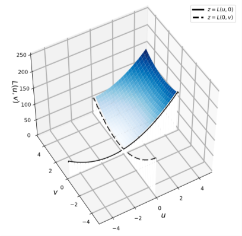
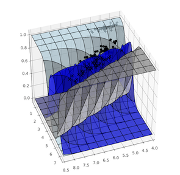

# 書籍「最短コースでわかる ディープラーニングの数学」サポートサイト

 
  
[Amazonへのリンク](https://www.amazon.co.jp/dp/4296102508/)

## 新着ニュース

#### 第6刷決定です (2022-12-23)

#### 日本ディープラーニング協会　合格者（CDLE）が選ぶ推薦書籍の17位に選ばれました

[日本ディープラーニング協会 推薦図書](https://www.jdla.org/recommendedbook/)

#### 好評につき続々海外版も出版中です

[韓国版](http://www.yes24.com/Product/Goods/89609761)

[台湾版](https://www.eslite.com/product/1001113882844739)

***

当サイトは、書籍「最短コースでわかる ディープラーニングの数学」用のサポートサイトです。    
Notebookファイルのダウンロードをしたい場合は、「**Notebookファイル一括ダウンロード手順**」に従ってまとめてダウンロードした後、ZIPファイルを解凍して下さい。  

* [Notebookファイル一括ダウンロード手順](download.md)

* [個別Notebookファイル](notebooks.md)

* [Notebook補足情報](notebook-ref.md)

* [アニメーション集](animations.md)

***

### 著者による補足情報

|ソース  |タイトルとリンク  |補足|
|---|---|---|
|プレゼン資料|[Pythonで理解するディープラーニング入門](https://speakerdeck.com/makaishi2/pythondeli-jie-surudeipuraninguru-men) |書籍ではあまり詳しく触れていないNumpy実装の解説があるので、実装コードの細かいところを知りたい読者は参考にして下さい。|
|qiita記事|[書籍「ディープラーニングの数学」のNotebookをGoogle Colaboratoryで動かす](https://qiita.com/makaishi2/items/8a7f530ad9b18b1f0b61)|実習コードをGoogle Colabで動かすための手順です。|
|qiita記事|[「ディープラーニングの数学」９章補足　3値分類モデルの決定境界の表示](https://qiita.com/makaishi2/items/c8f6c2191529f9e1102c)|９章の例題で決定境界を表示するコードとその解説があります。|
|プレゼン資料|[AI・DS領域を学習したい方に向けて](https://speakerdeck.com/makaishi2/aidsling-yu-woxue-xi-sitaifang-nixiang-kete)|2022-12-03に異業種データサイエンス研究会主催で行われたイベントでの招講演資料です。本書を含め、それぞれの書籍執筆への「思い」を語っています。|
|twitter|[@makaishi2](https://twitter.com/makaishi2)|著者のツイッターアカウント。書籍に関連した情報発信とretweetが中心です。|
|IBM Blog|[AI関連書籍三冊目を出版したIBM赤石雅典に聞く「AIと仕事と執筆」](https://www.ibm.com/blogs/solutions/jp-ja/data_science_and_ai_akaishi-san/)|旧勤務先のIBMのブログに著者のインタビュー記事が紹介されています。|

### 外部リンク集

|ソース  |タイトルとリンク  |補足|
|---|---|---|
|Amazon|[Amazonレビュー](https://www.amazon.co.jp/product-reviews/4296102508/)||
|読書メーター|[読書メーター 感想・レビュー](https://bookmeter.com/books/13706684)||
|ハイブリッド型総合書店 honto|[hontoレビュー](https://honto.jp/netstore/pd-review_0629564342_191.html)||
|レバテック　ブログ|[E資格の難易度や勉強方法、取得のメリットを徹底解説！](https://career.levtech.jp/guide/knowhow/article/697/)|E資格勉強法の解説の中で本書をご紹介いただいています。|
|有給医のライフハック記録|[書籍『最短コースでわかる　ディープラーニングの数学』を読了。【AI書籍の良著】](https://kataroh.hatenablog.com/entry/2022/01/21/193000)|「この書籍を通読し、ブラックボックスの中身が分かってきましたよ。」とのコメントをいただいています。|
|からあげ様ブログ|[GW中に「ディープラーニングの数学」と「身近な数学」と「Google Colaboratory（Python）」でじっくり数学を復習しました](https://karaage.hatenadiary.jp/entry/2019/05/08/073000)|AI関連で有名なブロガーである「からあげ」様による書評です。|
|日経XTECH 記者の目|[ディープラーニングは最低限の数学で分かる](https://tech.nikkeibp.co.jp/atcl/nxt/column/18/00138/041400268/)||
|日経XTECH 連載記事|[機械学習のための数学入門](https://tech.nikkeibp.co.jp/atcl/nxt/column/18/00816/)||
|ITMedia|[機械学習／ディープラーニングの「数学」が学べるオススメ本](https://www.atmarkit.co.jp/ait/articles/2103/18/news023.html#utm_term=share_sp)|3冊のおすすめ本の筆頭にあげていただいています。|
|キカガク公式ブログ|[【2020年版】初学者にオススメの機械学習参考書3選〜数学基礎編〜](https://blog.kikagaku.co.jp/2020/04/06/ai_math_books/)||
|Yusuke Otomo様ブログ|[AWS Certified Machine Learning – Specialty に合格してきました](https://yomon.hatenablog.com/entry/2019/05/awscertml)||
|カオカオ様ブログ|[G検定の勉強法](https://www.kaookaoo.com/gteststudymethod/)||
|orangeitems様ブログ|[機械学習・ディープラーニングの学習を入門レベルで挫折しないために](https://www.orangeitems.com/entry/2019/07/30/174944)||
|LWのサイゼリヤ|[機械学習入門書籍レビュー](https://bit.ly/3H6XZvj)|最近見つけた書評。褒めてるかけなしているかギリギリの線ですが、こういう風に読んでいる人もいるということをご紹介しておきます。|

***

* [正誤訂正](errors.md)

* [FAQ](faqs.md)

***

