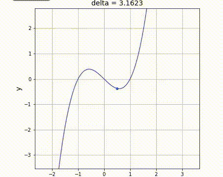
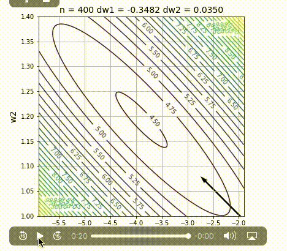
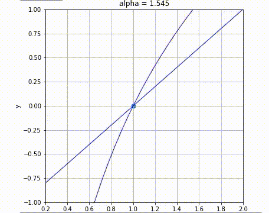

### アニメーション集
当ページは、書籍の中で参照しているアニメーションGIFをまとめて紹介しています。

#### 2章　微分
「微分とは結局関数のグラフを無限に拡大したときに直線で近似できる」ことを説明するためのアニメーションです。  
(書籍 p.52参照)  

#### 4章　勾配降下法  
(w1, w2)の2変数関数の等高線の中で、勾配降下法の繰り返し計算でパラメータ値がどのように変化するかを示すアニメーションです。  
(書籍 p.125)

#### 5章 対数関数の微分とネイピア数
y = x -1 のグラフと y = log_a x のグラフを重ね書きしています。
a(alpha)の値がちょうど2.7ぐらいの時に、二つの線が (x, y) = (1, 0) で接していることがわかります。  
(書籍 p.144)

[メインページに戻る](./README.md)