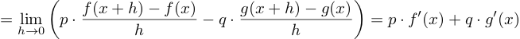
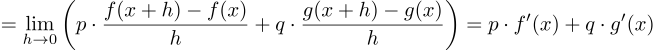
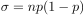
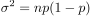
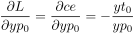
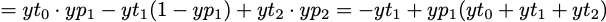
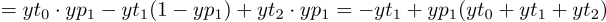
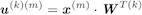

# 正誤訂正

#### 第1版第1刷　(第1版第2刷以降は修正済み)
|章  |ページ  |内容　　　　　　　|補足|最終更新日|
|---|---|---|---|---|
|11章|p.321|図11-13が正しくありません。正しい図は[リンク先](images/fig11-13-m.png)になります。||2019-05-27|

#### 第1版第1〜2刷 (第1版第3刷以降は修正済み)
|章  |ページ  |内容　　　　　　　|補足|最終更新日|
|---|---|---|---|---|
|まえがき|p.4|注釈2 (誤)完全平方 (正)平方完成|以下にも同じ誤記があります。 1章 p.28 下から7行目  p.33　注釈9  p.35 10行目  7章 p.172 12行目|2019-07-12|
|2章|p.49|下から7行目 (誤)f(1)=2, f(-1)=2と出力して0の値を取る (正)f(1)=2, f(-1)=2と出力して2の値を取る||2019-08-19|
|2章|p.62|上から2つめの式が正しくありません。 (誤) (正)||2019-06-12|
|5章|p.150|図5-11 (誤)0.0351 0.2595 0.7354  (正)0.0351 0.2595 0.7054||2019-07-12|
|6章|p.160|下から3行目 (誤)  (正) ||2019-07-18|
|10章|p.269|9行目  (誤)768(=28x28)   (正)784 (=28x28)||2019-07-12|
|10章|p.269|13行目  (誤)CNNついては  (正)CNNについては||2019-07-12|

#### 第1版第1〜3刷 (第1版4刷以降は修正済み)
|章  |ページ  |内容　　　　　　　|補足|最終更新日|
|---|---|---|---|---|
|1章|P.26|1行目   (誤)回帰モデルでの誤差とは、図1-6にあるように個々の点から予測値を表す直線に垂直に下した直線の長さ、つまり(yt - yp)にあたります。   (正)回帰モデルでの誤差は(yt - yp)であり、図1-6では青い直線の部分にあたります。||2019-12-24| 
|1章|P.38|図1-20   (誤)6.1 確率変数と度数分布   (正)6.1 確率変数と確率分布||2019-09-06| 
|2章|p.56|脚注   (誤) (2.3.1)式   (正) (2.3.2)式||2019-09-06|
|2章|p.58|12行目   (誤) (2.3.3)の式   (正) (2.3.4)の式||2019-09-06|
|3章|p.82|6行目   (誤)「方向と向きを持つ量」  (正)「向きと大きさを持つ量」||2019-09-06|
|3章|p.91|下から9行目   (誤)三角関数  (正)三角比||2019-09-06| 
|5章|p.142|11行目   (誤) xを大きくしていったとき  (正) hをゼロに近づけていったとき||2019-10-02|
|5章|p.142|11行目   (誤) 2.71727...  (正) 2.71828...||2019-09-06|
|7章|p.179|下から9行目 (誤) 差の２乗 (正) 差の２乗和||2019-11-29|
|8章|p.209|下から8行目 (誤) 図8-4で中央の (正) 図8-5で中央の||2019-11-29|
|8章|p.216|脚注 (誤) 最初に出てきたのは1.3節「はじめての機械学習モデル」 (正) 最初に出てきたのは1.5節「機械学習・ディープラーニングにおける数学の必要性」||2019-11-29|
|8章|p.234|下から12行目 (誤) 1/4 * 3万ギル * 1/4 * 3万ギル  (正) 1/4 * 3万ギル + 1/4 * 3万ギル||2019-11-29|
|9章|p.249|式(9.6.6) (他の2つの式も同様)  (誤)   (正)  ||2019-11-29|
|9章|p.250|下から2行目   (誤) (9.6.3)を書き直すと  (正) (9.6.4)を書き直すと||2019-10-01|
|9章|p.259|下から8行目   (誤) 実際にはyt, yp, yd: 数値 -> ベクトル　W: ベクトル -> 行列とデータの構造が変わっています。  (正) 実際には、yt, yp, yd, Wのそれぞれについてベクトルから行列にデータの構造が変わっています。||2020-03-09|
|10章|p.271|下から7行目   (誤) 769次元  (正) 785次元||2019-11-29|
|10章|p.282|2-3行目   (誤) 1-b 隠れ層1   1-c 隠れ層2   (正) 1-b 隠れ層2  1-c 隠れ層1  ||2019-10-01|
|11章|p.319|下から5-6行目   (誤) 減衰率 (learning_decay)   (正) 減衰率 (learning rate decay)  ||2019-11-29|

#### 第1版第1〜4刷
|章  |ページ  |内容　　　　　　　|補足|最終更新日|
|---|---|---|---|---|
|7章|p.184|下から7行目  (誤) j = 0, 1  (正) i = 0, 1||2020-12-24|
|8章|p.221|上から9行目  (誤) a: 学習率  (正) α: 学習率||2020-12-06|
|9章|p.250|上から3行目  (誤)   (正)||2020-12-14|
|9章|p.257|下から4行目「関数predの実装です。」の後に以下の(注8)を追記。 (注8)ここで示すコードでは、(9.7.1)の式を変形したを実装しています。Wに関しては行と列が入れ換わった形になります(転置行列)。今回のコードでは、複数の学習データを同時に扱っていて、xで示す入力データも、出力uも、ベクトルでなく行列になります。その場合、上の式の方が都合が良いからです。||2020-10-07|
|10章|p.269|図10-2   元々利用していた関数でMNISTデータのダウンロードができなくなったため、Notebookを修正しダウンロード方法を変更しました。その影響でイメージが変わっています。正しいイメージはリンク先になります。[リンク先](images/fig-10-02-m.png)||2020-06-17|
|10章|p.287|図10-9 10行目 (出版時) ax = plt.subplot(2, N/2, i + 1) (現在) ax = plt.subplot(2, int(N/2), i + 1) |matplotlibバージョンアップに伴いコード修正が必要になりました|2022-10-08|
|10章|p.287|図10-9   元々利用していた関数でMNISTデータのダウンロードができなくなったため、Notebookを修正しダウンロード方法を変更しました。その影響でイメージが変わっています。正しいイメージはリンク先になります。[リンク先](images/fig-10-02-m.png)||2020-06-17|
|10章|p.300|上から3行目   (誤)20個中18個 (正)20個中19個||2020-06-17|
|10章|p.300|図10-22   元々利用していた関数でMNISTデータのダウンロードができなくなったため、Notebookを修正しダウンロード方法を変更しました。その影響でイメージが変わっています。正しいイメージはリンク先になります。[リンク先](images/fig-10-22-m.png)||2020-06-17|
|10章|p.303|図10-26   元々利用していた関数でMNISTデータのダウンロードができなくなったため、Notebookを修正しダウンロード方法を変更しました。その影響でイメージが変わっています。正しいイメージはリンク先になります。[リンク先](images/fig-10-26-m.png)||2020-06-17|
|10章|p.303|上から2行目   (誤)誤認識していた2つについても  (正)誤認識していた1つについても||2020-06-17|

[メインページに戻る](./README.md)