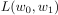
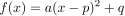
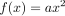
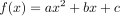
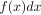
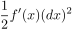
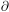
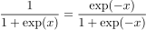
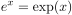
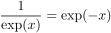

# FAQ

|章  |ページ  |質問　　　　　　　|回答|最終更新日|
|---|---|---|---|---|
|1|p.26|損失関数  の意味がわかりません|これは2つの変数で値が定まる2変数関数の表記法で、4章に出てくる話を先取りしています。4章 p.107の図4-2を見てイメージを持って下さい。|2019-07-09|
|1|p.28|「2次関数の完全平方」とは|まず「完全平方」は「平方完成」の誤りです。 2次関数 のグラフは、2次関数 のグラフを(p, q)だけ平行移動したものであることがわかっています。このことを逆に利用してのグラフをの形に書き換える方法が「平方完成」です。より詳細な計算方法については、数Ⅰの解説書を参照してください。|2019-07-09|
|2|p.75|図2-17で示す図形は長方形でp.72図2-15のような台形ではないのに、これで面積になるのはなぜか|二つの図形の違いは、上部の三角形の部分です。横幅を無限に0に近づけると、長方形の面積はですが、三角形の面積はとなります。(p.72参照)。 長方形の面積と比べると無視できる大きさなので(両者をdxで割ってみるとわかります)、三角形の部分は考慮に入れなくていいのです。|2019-11-25|
|4|p.109|記号「」の読み方は|いろいろな流派があります。代表的な読み方は「ラウンドディー」「パーシャルディー」「デル」等です。|2019-07-09|
|5|p.148|なぜとなるのかわかりません|の書き換えに注意すると、p.133の公式(5.1.10)は、になります。元の式の分子分母をexp(x)で割った後でこの結果を利用すると、右辺の結果が得られます。|2019-08-18|
|9|p.258|Wの次元数は(D, N)でなく(N, D)なのでは?|書籍の記述のとおりW・xという行列計算をするのであれば、次元は(N, D)である必要があります。しかし、コードをみるとわかるとおり実際にはx@Wと逆の順番に積を計算しています。ここで行と列の役割が逆になるため、結果的に(D, N)で辻褄が合うようになっています。|2020-05-12|
|10|p.271|表10-1 なぜ隠れ層でシグモイド関数を、出力層でsoftmax関数を活性化関数にするのかわかりません|モデルの構造は出力に近いところから決まります。この課題は9章と同じ多値分類問題なので、出力層のsoftmax関数は自動的に決まります。隠れ層に関しては1入力1出力のタイプの活性化関数である必要があるので、シグモイド関数となります。 この説明を読んで「1入力1出力の条件を満たすなら他の関数でもいいのでは」と思った読者もいると思います。その答えはp.297にあります。|2019-07-13|
|11|p.310|Jupyter Notebookで11章のサンプルコードが動きません|巻末の手順を使ってAnacondaで導入した環境にはKerasが導入されていないため、追加導入が必要です。書籍執筆時には複雑な手順だったのですが、最新版のanaconda1.7.2では導入手順が簡単になりました。コマンドラインで  ``$ conda install keras``  としてJupyter Notebookを再起動すればサンプルコードが利用可能になります。|2020-05-12|

[メインページに戻る](./README.md)